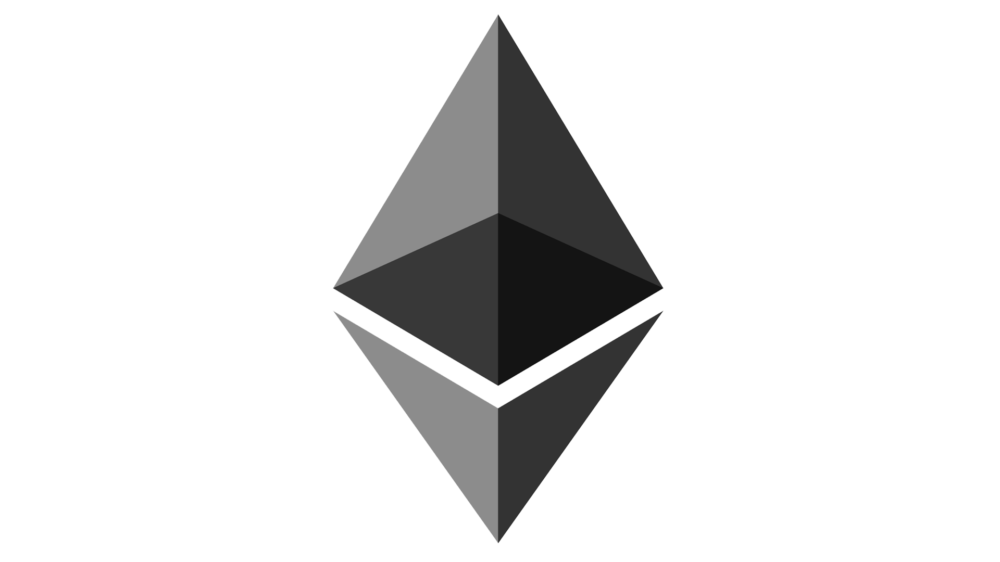

#### Hey👋, I'm Mayowa Afe-Ogundele
 

I'm a Sofware Engineer with over 9 years experience building enterprise backend systems. I have been stuck with corprate tech, but I amd giving a stab at Open Source.

### Tech Stacks I have used in Production
- 🛠   PHP, Laravel, VueJs, Javascript, C#, ASP.net, VB.net
- 🌱   I've also learnt RUST, Solidity, Blockchain Development
- 👯   I'm looking to collaborate on Blockchain and Systemd Developement Projects
- 💬   Ask me about anything [here](https://github.com/0101coding/0101coding/issues/)! I am happy to help.
- 💻   I'm currently exploring Systems Developement. 

### Languages and Tools

<code></code>
<code></code>
<code></code>
<code></code>
<code></code>
<code> </code>
<code> </code>
<code> </code>
<code> </code><code></code>
<!-- 
**0101coding/0101coding** is a ✨ _special_ ✨ repository because its `README.md` (this file) appears on your GitHub profile.

Here are some ideas to get you started:

- 🔭 I’m currently working on ...
- 🌱 I’m currently learning ...
- 👯 I’m looking to collaborate on ...
- 🤔 I’m looking for help with ...
- 💬 Ask me about ...
- 📫 How to reach me: ...
- 😄 Pronouns: ...
- ⚡ Fun fact: ...
-->
